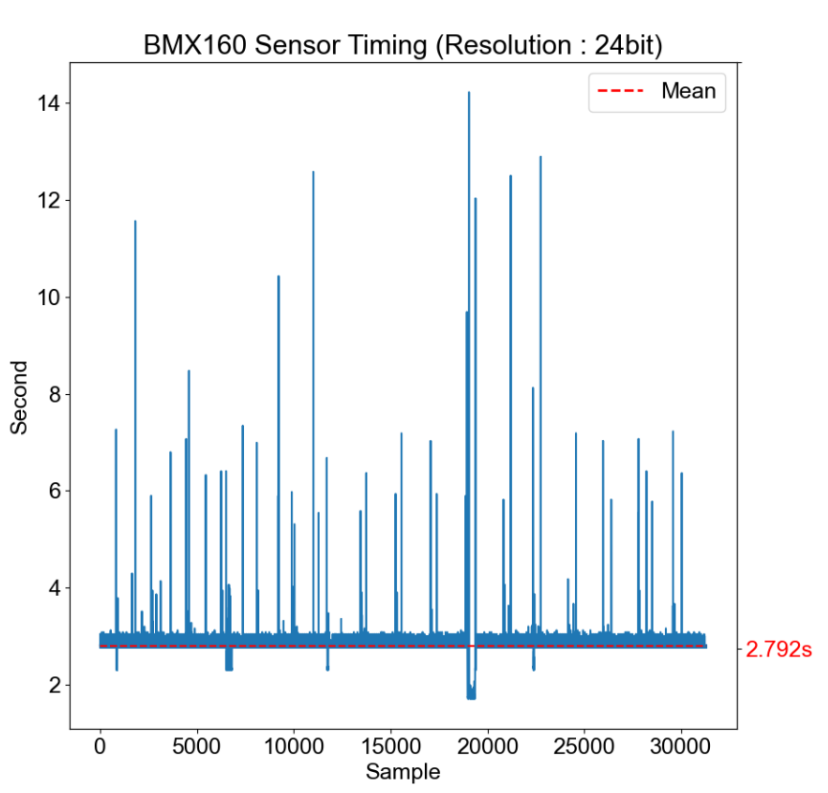

# Bmx160 Program

Veri okuma programı başlatılmadan önce init programı (Python3) çalıştırılarak sensör kaydedicileri ayarlanmalıdır.
Okuma programı (C) dosya adı istemektedir. Program ARM Timer donanımı set ederek kendi Frekansını ayarlamaktadır. 15 bayt versiyonu için 380 Hz, 24 bayt versiyonu (manyetometre dahil) versiyonu için 240 Hz üzerinde çıkılmaması önerilir.
Program runtime da buffer belleğe yazar ve Ctrl+C kesmesi ile kalıcı belleğe yazılır ve program durdurulur. 
Ölçüm dosyası hex formatında kayıt edilir. hex_converter programı (Python3) ile program milisaniye, g, derece/saniye ve mikroTesla birimlerinde ve sırasında anlamlı verilere dönüştürülür.

Core Dedication Farkı 

Önce

Sonra

